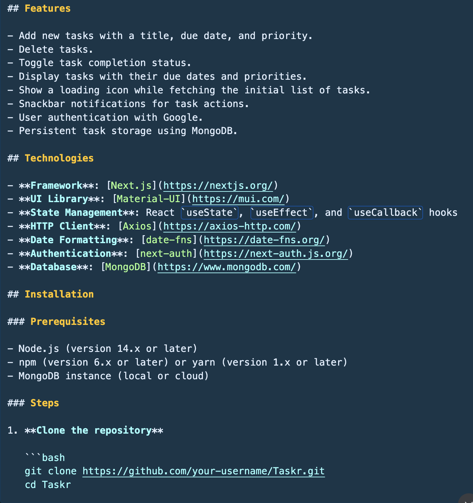
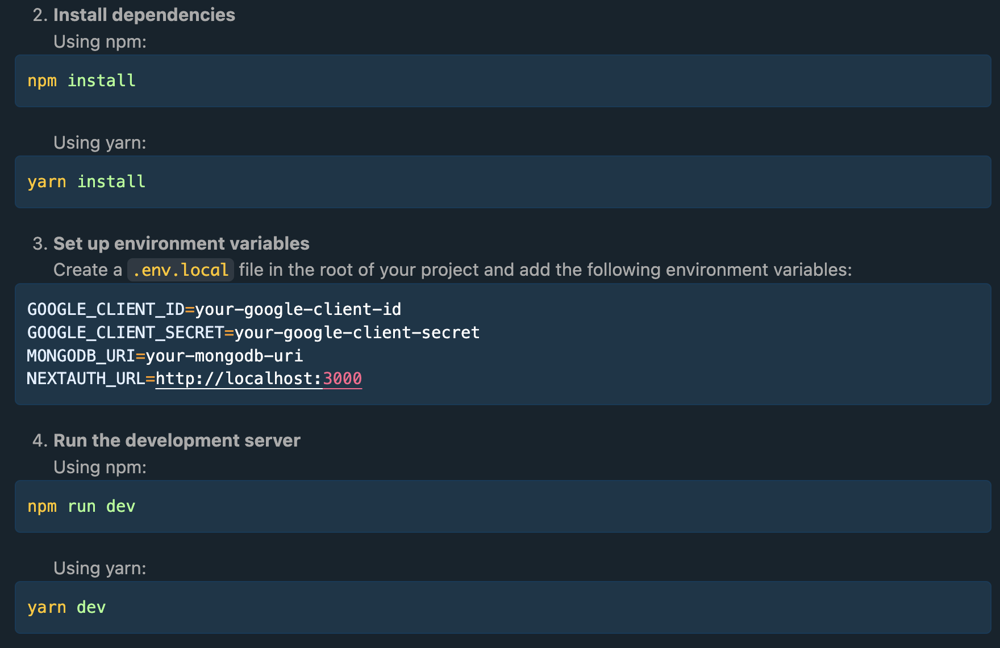
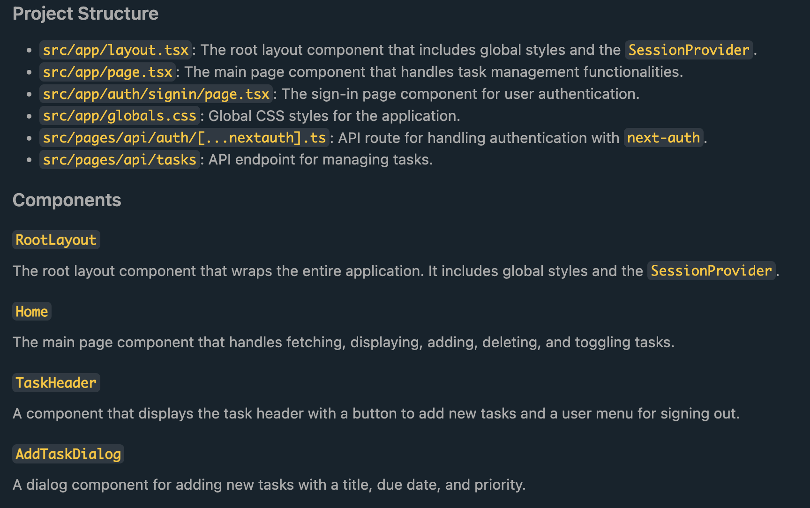
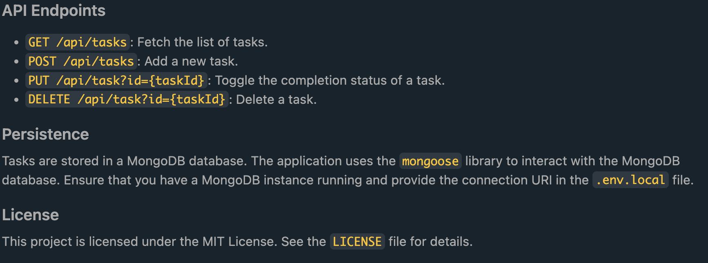

# Taskr

Taskr is a task management application built with Next.js and Material-UI. It allows users to add, delete, and toggle tasks with different priorities and due dates. The application also includes authentication using `next-auth` and supports Google as an authentication provider.

